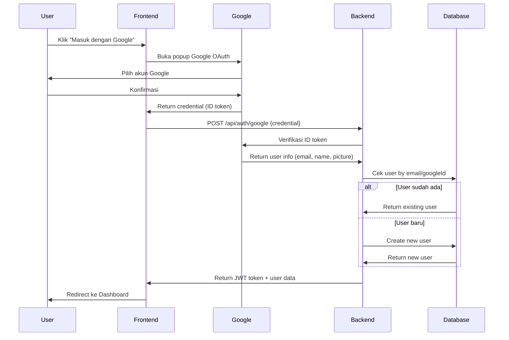

# 📸 Lensify.co — Platform Penyewaan Kamera Profesional Online


---

## 📖 Daftar Isi

- [Pengenalan](#-pengenalan)
- [Fitur Utama](#-fitur-utama)
- [Tech Stack](#-tech-stack)
- [Arsitektur Sistem](#-arsitektur-sistem)
- [Struktur Folder](#-struktur-folder)
- [Database Schema](#-database-schema)
- [Role & Hak Akses](#-role--hak-akses)
- [User Flow](#-user-flow)
- [Instalasi & Menjalankan Project](#-instalasi--menjalankan-project)
- [Environment Variables](#-environment-variables)
- [Konvensi & Standar Kode](#-konvensi--standar-kode)

---

## 🌐 Pengenalan

**Lensify.co** adalah platform penyewaan kamera profesional berbasis web yang memungkinkan pengguna untuk menelusuri, memilih, dan menyewa berbagai jenis peralatan kamera secara online. Platform ini dibangun dengan arsitektur **monorepo** yang terdiri dari dua bagian utama: **Frontend** (React + Vite) dan **Backend** (Express.js + Prisma ORM).

### Tujuan

- Mempermudah proses penyewaan kamera bagi fotografer, videografer, dan content creator.
- Menyediakan sistem manajemen inventaris dan pemesanan yang terintegrasi bagi admin.
- Memberikan pengalaman pengguna yang premium dengan desain modern dan responsif.

### Target Pengguna

| Pengguna | Deskripsi |
|----------|-----------|
| **User (Penyewa)** | Fotografer, videografer, mahasiswa, atau siapa saja yang membutuhkan kamera untuk disewa |
| **Admin (Pengelola)** | Pemilik usaha atau staf yang mengelola inventaris kamera, pesanan, dan laporan |

---

## ✨ Fitur Utama

### Sisi User (Penyewa)

| Fitur | Deskripsi |
|-------|-----------|
| 🏠 Landing Page | Halaman utama dengan hero section, kategori gear, top cameras, cara kerja, dan testimoni |
| 📋 Katalog | Penelusuran dan filter kamera berdasarkan kategori, harga, ketersediaan tanggal, dan pencarian |
| 📷 Detail Kamera | Halaman detail kamera lengkap dengan spesifikasi, review, galeri gambar, dan status ketersediaan |
| 🛒 Keranjang (Cart) | Sistem keranjang belanja untuk menambahkan beberapa kamera sekaligus |
| 💳 Checkout | Proses checkout multi-item dengan upload KTP, pemilihan metode pembayaran, dan input data diri |
| 📜 Riwayat Booking | Daftar semua pesanan pengguna dengan detail status, opsi cancel, review, dan cetak invoice |
| ⭐ Review Gear | Sistem review dan rating per kamera setelah status booking `RETURNED` |
| 💬 Testimoni Layanan | Kirim testimoni umum tentang pengalaman menggunakan platform Lensify |
| 👤 Profil & Settings | Manajemen profil pengguna (nama, telepon, avatar) dan pengaturan akun |
| 📊 Dashboard User | Overview statistik personal: total booking, pengeluaran, kamera favorit |

### Sisi Admin (Pengelola)

| Fitur | Deskripsi |
|-------|-----------|
| 📊 Dashboard Analytics | Statistik real-time: booking hari ini, revenue, tren bulanan/harian, top performers, distribusi kategori |
| 📦 Kelola Produk (Gear) | CRUD kamera dengan upload gambar, spesifikasi, harga, stok, dan ketersediaan |
| 📝 Kelola Sewa (Orders) | Manajemen booking: ubah status (`PENDING` → `CONFIRMED` → `ONGOING` → `RETURNED` / `CANCELLED`), search, dan filter |
| 📈 Laporan (Reports) | Laporan revenue dengan filter tanggal, toggle chart harian/bulanan, dan export PDF |
| ⚙️ Pengaturan Admin | Manajemen profil admin dan pengaturan akun |
| 💬 Kelola Testimoni | Melihat dan membalas review gear serta testimoni layanan dari pengguna |
| 🏷️ Booking Offline | Membuat booking langsung dari admin untuk walk-in customer |

---

## 🛠 Tech Stack

### Frontend

| Teknologi | Versi | Kegunaan |
|-----------|-------|----------|
| **React** | ^18.3.1 | Library UI utama |
| **Vite** | ^6.0.3 | Build tool & dev server |
| **React Router DOM** | ^6.28.0 | Client-side routing |
| **Zustand** | ^5.0.2 | State management (auth, cart, loading) |
| **Axios** | ^1.7.9 | HTTP client untuk komunikasi API |
| **TailwindCSS** | ^3.4.16 | Utility-first CSS framework |
| **Framer Motion** | ^12.40.0 | Animasi dan transisi halaman |
| **Lucide React** | ^0.468.0 | Icon library |
| **React Hot Toast** | ^2.4.1 | Notifikasi toast |
| **date-fns** | ^4.1.0 | Utilitas format tanggal |
| **React DatePicker** | ^7.5.0 | Komponen pemilihan tanggal |
| **html2canvas + jsPDF** | ^1.4.1 / ^4.2.1 | Export laporan ke PDF |
| **Styled Components** | ^6.4.2 | CSS-in-JS (digunakan selektif) |

### Backend

| Teknologi | Versi | Kegunaan |
|-----------|-------|----------|
| **Node.js** | — | Runtime JavaScript server-side |
| **Express.js** | ^4.21.2 | Framework web/REST API |
| **Prisma ORM** | ^5.22.0 | ORM untuk database query & migrasi |
| **SQLite** | — | Database relasional ringan (file-based) |
| **JWT (jsonwebtoken)** | ^9.0.2 | Autentikasi berbasis token |
| **bcryptjs** | ^2.4.3 | Hashing password |
| **Zod** | ^3.24.1 | Validasi input/schema |
| **Multer** | ^1.4.5 | Upload file (gambar) |
| **CORS** | ^2.8.5 | Cross-Origin Resource Sharing |
| **dotenv** | ^16.4.7 | Konfigurasi environment variable |
| **Nodemon** | ^3.1.9 | Hot reload development server |

### Tools & Infrastruktur

| Tool | Kegunaan |
|------|----------|
| **Prisma Studio** | GUI untuk browsing database |
| **PostCSS + Autoprefixer** | Processing CSS |
| **Google Fonts** | Font: Manrope & Inter |
| **Material Symbols** | Icon tambahan |

---

## 🏗 Arsitektur Sistem

```
┌──────────────────────┐          ┌──────────────────────┐
│                      │   HTTP   │                      │
│   Frontend (React)   │ ◄──────► │  Backend (Express)   │
│   Port: 5173         │  REST    │  Port: 5000          │
│                      │  API     │                      │
└──────────┬───────────┘          └──────────┬───────────┘
           │                                 │
           │                     ┌───────────▼───────────┐
           │                     │                       │
           │                     │   Prisma ORM          │
           │                     │                       │
           │                     └───────────┬───────────┘
           │                                 │
           │                     ┌───────────▼───────────┐
           │                     │                       │
           │                     │   SQLite Database     │
           │                     │   (prisma/dev.db)     │
           │                     │                       │
           └─────────────────────┴───────────────────────┘
                 Uploads disimpan di frontend/public/uploads/
```

### Pola Komunikasi

1. **Frontend → Backend**: Semua request melalui Axios instance (`services/api.js`) dengan base URL `http://localhost:5000/api`
2. **Autentikasi**: Token JWT disimpan di `sessionStorage` dan dikirim via header `Authorization: Bearer <token>`
3. **File Upload**: Menggunakan `multipart/form-data` via Multer, file disimpan di `frontend/public/uploads/`
4. **Proxy**: Vite dev server mem-proxy path `/uploads` ke backend port 5000

---

## 📁 Struktur Folder

```
lensify/
├── backend/
│   ├── prisma/
│   │   ├── schema.prisma          # Definisi model database
│   │   ├── migrations/            # Riwayat migrasi database
│   │   └── dev.db                 # File database SQLite
│   ├── src/
│   │   ├── app.js                 # Entry point Express server
│   │   ├── controllers/           # Business logic handlers
│   │   │   ├── adminController.js
│   │   │   ├── authController.js
│   │   │   ├── bookingController.js
│   │   │   ├── cameraController.js
│   │   │   ├── reviewController.js
│   │   │   └── testimonialController.js
│   │   ├── routes/                # Definisi routing API
│   │   │   ├── adminRoutes.js
│   │   │   ├── authRoutes.js
│   │   │   ├── bookingRoutes.js
│   │   │   ├── cameraRoutes.js
│   │   │   ├── reviewRoutes.js
│   │   │   └── testimonialRoutes.js
│   │   ├── middleware/            # Middleware Express
│   │   │   ├── authMiddleware.js
│   │   │   ├── adminMiddleware.js
│   │   │   └── uploadMiddleware.js
│   │   └── utils/                 # Utilitas (seeder, reset)
│   │       ├── seed.js
│   │       └── reset-db.js
│   ├── .env                       # Konfigurasi environment
│   └── package.json
│
├── frontend/
│   ├── public/
│   │   └── uploads/               # File upload (gambar kamera, KTP, avatar)
│   ├── src/
│   │   ├── App.jsx                # Root component + routing
│   │   ├── main.jsx               # Entry point React
│   │   ├── index.css              # Global styles
│   │   ├── components/
│   │   │   ├── features/          # Komponen fitur spesifik
│   │   │   │   ├── CameraCard.jsx
│   │   │   │   └── CartDrawer.jsx
│   │   │   ├── layout/            # Komponen layout
│   │   │   │   ├── Navbar.jsx
│   │   │   │   ├── Footer.jsx
│   │   │   │   ├── AdminSidebar.jsx
│   │   │   │   └── UserSidebar.jsx
│   │   │   └── ui/                # Komponen UI reusable
│   │   │       ├── FlipCard.jsx
│   │   │       ├── GlobalLoader.jsx
│   │   │       ├── HowItWorksCard.jsx
│   │   │       ├── Loader.jsx
│   │   │       └── Tooltip.jsx
│   │   ├── pages/                 # Halaman user
│   │   │   ├── Home.jsx
│   │   │   ├── Auth.jsx
│   │   │   ├── Login.jsx
│   │   │   ├── Register.jsx
│   │   │   ├── Catalog.jsx
│   │   │   ├── CategoryPage.jsx
│   │   │   ├── CameraDetail.jsx
│   │   │   ├── Checkout.jsx
│   │   │   ├── BookingHistory.jsx
│   │   │   ├── UserDashboard.jsx
│   │   │   ├── UserSettings.jsx
│   │   │   ├── UserTestimonials.jsx
│   │   │   ├── Profile.jsx
│   │   │   ├── Unauthorized.jsx
│   │   │   └── admin/             # Halaman admin
│   │   │       ├── AdminLogin.jsx
│   │   │       ├── Dashboard.jsx
│   │   │       ├── Products.jsx
│   │   │       ├── Orders.jsx
│   │   │       ├── Reports.jsx
│   │   │       ├── Settings.jsx
│   │   │       └── AdminTestimonials.jsx
│   │   ├── services/
│   │   │   └── api.js             # Axios instance + API endpoints
│   │   └── store/                 # Zustand state stores
│   │       ├── authStore.js
│   │       ├── cartStore.js
│   │       └── loadingStore.js
│   ├── index.html                 # HTML template
│   ├── vite.config.js             # Konfigurasi Vite
│   ├── tailwind.config.js         # Konfigurasi TailwindCSS
│   └── package.json
│
└── package.json                   # Root package (workspace config)
```

---

## 🗄 Database Schema

Lensify menggunakan **SQLite** sebagai database dengan **Prisma ORM** untuk manajemen schema dan query.

### Entity Relationship Diagram (ERD)

```
┌──────────────┐       ┌──────────────┐       ┌──────────────┐
│     User     │       │    Camera     │       │   Booking    │
├──────────────┤       ├──────────────┤       ├──────────────┤
│ id (PK)      │       │ id (PK)      │       │ id (PK)      │
│ name         │       │ name         │       │ userId (FK)  │──► User
│ email (UQ)   │       │ brand        │       │ cameraId (FK)│──► Camera
│ password     │       │ category     │       │ startDate    │
│ phone?       │       │ description  │       │ endDate      │
│ avatar?      │       │ specs        │       │ totalDays    │
│ role         │       │ pricePerDay  │       │ totalPrice   │
│ createdAt    │       │ stock        │       │ status       │
│ updatedAt    │       │ images       │       │ notes?       │
└──────┬───────┘       │ isAvailable  │       │ address?     │
       │               │ isDeleted    │       │ phone?       │
       │               │ createdAt    │       │ ktpPath?     │
       │               │ updatedAt    │       │ paymentMethod│
       │               └──────┬───────┘       │ createdAt    │
       │                      │               │ updatedAt    │
       │                      │               └──────┬───────┘
       │                      │                      │
       │               ┌──────▼───────┐              │
       │               │    Review    │              │
       │               ├──────────────┤              │
       └──────────────►│ id (PK)      │◄─────────────┘
                       │ userId (FK)  │
                       │ cameraId (FK)│
                       │ bookingId(UQ)│
                       │ rating       │
                       │ comment?     │
                       │ reply?       │
                       │ createdAt    │
                       └──────────────┘

┌──────────────┐
│ Testimonial  │
├──────────────┤
│ id (PK)      │
│ userId (FK)  │──► User
│ rating       │
│ message      │
│ reply?       │
│ createdAt    │
└──────────────┘
```

### Model

| Model | Deskripsi | Relasi |
|-------|-----------|--------|
| **User** | Akun pengguna (user/admin) | Has many: Booking, Review, Testimonial |
| **Camera** | Data peralatan kamera | Has many: Booking, Review |
| **Booking** | Transaksi penyewaan | Belongs to: User, Camera. Has one: Review |
| **Review** | Review per kamera per booking | Belongs to: User, Camera, Booking |
| **Testimonial** | Testimoni umum layanan | Belongs to: User |

### Status Booking

```
PENDING ──► CONFIRMED ──► ONGOING ──► RETURNED
  │                                       │
  └──────────► CANCELLED                 Review
```

| Status | Deskripsi |
|--------|-----------|
| `PENDING` | Pesanan baru, menunggu konfirmasi admin |
| `CONFIRMED` | Disetujui admin, menunggu pengambilan |
| `ONGOING` | Kamera sedang disewa |
| `RETURNED` | Kamera telah dikembalikan (bisa beri review) |
| `CANCELLED` | Pesanan dibatalkan (oleh user atau admin) |

---

## 🔐 Role & Hak Akses

Lensify menerapkan **Role-Based Access Control (RBAC)** dengan dua role utama:

### 1. Role: `USER` (Default)

Akses ke:
- ✅ Halaman publik (Home, Catalog, Detail Kamera)
- ✅ Dashboard User (`/dashboard`)
- ✅ Keranjang & Checkout (`/checkout`)
- ✅ Riwayat Booking (`/bookings`)
- ✅ Profil & Settings (`/profile`, `/settings`)
- ✅ Testimoni (`/testimonials`)
- ✅ Kategori Gear (`/category/:slug`)
- ❌ Halaman Admin → Dialihkan ke halaman **403 Unauthorized**

### 2. Role: `ADMIN`

Akses ke:
- ✅ Admin Dashboard (`/admin`)
- ✅ Kelola Produk (`/admin/products`)
- ✅ Kelola Pesanan (`/admin/orders`)
- ✅ Laporan (`/admin/reports`)
- ✅ Pengaturan Admin (`/admin/settings`)
- ✅ Kelola Testimoni (`/admin/testimonials`)
- ❌ Halaman User → Dialihkan ke halaman **403 Unauthorized**

### Implementasi Proteksi

```jsx
// ProtectedRoute component di App.jsx
<ProtectedRoute userOnly>   // Hanya USER yang bisa akses
<ProtectedRoute adminOnly>  // Hanya ADMIN yang bisa akses
```

### Middleware Backend

| Middleware | File | Fungsi |
|------------|------|--------|
| `authMiddleware` | `authMiddleware.js` | Verifikasi JWT token, extract `userId` dan `userRole` |
| `adminMiddleware` | `adminMiddleware.js` | Cek `userRole === 'ADMIN'`, return 403 jika bukan |
| `uploadMiddleware` | `uploadMiddleware.js` | Handle file upload (Multer), validasi tipe & ukuran |

---

## 🔄 User Flow

### Flow Penyewa (User)

```
┌─────────┐     ┌──────────┐     ┌─────────┐     ┌──────────┐
│  Buka   │────►│ Register │────►│  Login  │────►│ Dashboard│
│ Website │     │ / Login  │     │         │     │  User    │
└─────────┘     └──────────┘     └─────────┘     └────┬─────┘
                                                      │
                    ┌─────────────────────────────────┘
                    ▼
              ┌──────────┐     ┌──────────┐     ┌──────────┐
              │ Katalog  │────►│  Detail  │────►│ Tambah   │
              │ / Search │     │  Kamera  │     │ ke Cart  │
              └──────────┘     └──────────┘     └────┬─────┘
                                                     │
                    ┌────────────────────────────────┘
                    ▼
              ┌──────────┐     ┌──────────┐     ┌──────────┐
              │ Checkout │────►│  Upload  │────►│ Pesanan  │
              │ (Form)   │     │  KTP +   │     │ Berhasil │
              │          │     │  Payment │     │ (PENDING)│
              └──────────┘     └──────────┘     └────┬─────┘
                                                     │
                    ┌────────────────────────────────┘
                    ▼
              ┌──────────┐     ┌──────────┐     ┌──────────┐
              │ Riwayat  │────►│ Tunggu   │────►│  Kamera  │
              │ Booking  │     │ CONFIRMED│     │ RETURNED │
              │          │     │          │     │          │
              └──────────┘     └──────────┘     └────┬─────┘
                                                     │
                                               ┌─────▼─────┐
                                               │   Beri    │
                                               │  Review   │
                                               │ & Rating  │
                                               └───────────┘
```

### Flow Admin

```
┌───────────┐     ┌──────────┐     ┌──────────────────┐
│  Admin    │────►│ Dashboard│────►│ Kelola Produk /  │
│  Login    │     │ Overview │     │ Pesanan / Report │
└───────────┘     └──────────┘     └────────┬─────────┘
                                            │
              ┌─────────────────────────────┘
              ▼
        ┌─────────────┐     ┌──────────────┐
        │ Konfirmasi  │────►│ Update Status│
        │ Pesanan     │     │ → ONGOING →  │
        │ (PENDING)   │     │  RETURNED    │
        └─────────────┘     └──────────────┘
```

### Flow Google Login



---

## 🔐 Autentikasi & Google Login

Lensify mendukung autentikasi menggunakan email/password standar dan juga **Login dengan Google** (menggunakan OAuth 2.0 via Google Identity Services).

### 🔑 Panduan Mendapatkan Google Client ID

> **PENTING:** Fitur Google Login **TIDAK AKAN BERFUNGSI** sampai Anda memasukkan Google Client ID yang valid ke file `.env` di backend dan frontend.

#### Langkah-langkah:

1. **Buka Google Cloud Console**
   - Kunjungi **[https://console.cloud.google.com/](https://console.cloud.google.com/)** dan login dengan akun Google Anda.
2. **Buat Project Baru**
   - Klik dropdown project di pojok kiri atas, klik **"New Project"**, beri nama (misal: "Lensify"), lalu klik **"Create"**.
3. **Konfigurasi OAuth Consent Screen**
   - Buka **APIs & Services** → **OAuth consent screen**.
   - Pilih **External** → klik **Create**.
   - Isi form (*App name*, *User support email*, *Developer contact email*) lalu **Save and Continue** sampai selesai.
4. **Buat OAuth 2.0 Client ID**
   - Buka **APIs & Services** → **Credentials**.
   - Klik **"+ CREATE CREDENTIALS"** → **"OAuth client ID"**.
   - Pilih **Application type**: **Web application**.
   - Di **Authorized JavaScript origins**, tambahkan: `http://localhost:5173`
   - Di **Authorized redirect URIs**, tambahkan: `http://localhost:5173`
   - Klik **"Create"**.
5. **Copy Client ID**
   - Copy teks Client ID yang diberikan (format: `xxxxx.apps.googleusercontent.com`).
6. **Masukkan ke File .env**
   - Edit `backend/.env` dan `frontend/.env`, tambahkan:
     ```env
     # backend/.env
     GOOGLE_CLIENT_ID=xxxxx.apps.googleusercontent.com
     
     # frontend/.env
     VITE_GOOGLE_CLIENT_ID=xxxxx.apps.googleusercontent.com
     ```
7. **Restart Server**

### Catatan Penting

> - User yang register via **Google** tidak memiliki password. Jika mereka mencoba login via form email/password, akan muncul pesan: *"Akun ini terdaftar melalui Google. Silakan gunakan tombol Masuk dengan Google."*
> - Jika user sudah punya akun (register biasa) lalu login via Google dengan **email yang sama**, akun akan otomatis terhubung (linked) dengan Google.

---

## 🚀 Instalasi & Menjalankan Project

### Prasyarat

- **Node.js** >= 18.x
- **npm** >= 9.x

### 1. Clone / Buka Project

```bash
cd lensify
```

### 2. Install Dependencies

```bash
# Backend
cd backend
npm install

# Frontend
cd ../frontend
npm install
```

### 3. Setup Database

```bash
cd backend

# Generate Prisma Client
npx prisma generate

# Jalankan migrasi database
npx prisma migrate dev --name init

# (Opsional) Seed data awal
npm run db:seed
```

### 4. Jalankan Server

```bash
# Terminal 1 — Backend (port 5000)
cd backend
npm run dev

# Terminal 2 — Frontend (port 5173)
cd frontend
npm run dev
```

### 5. Akses Aplikasi

| URL | Deskripsi |
|-----|-----------|
| `http://localhost:5173` | Frontend (Halaman utama) |
| `http://localhost:5000/api/health` | Backend health check |
| `npx prisma studio` (di folder backend) | Database browser GUI |

---

## 🔧 Environment Variables

### Backend (`backend/.env`)

| Variable | Deskripsi | Default |
|----------|-----------|---------|
| `DATABASE_URL` | Connection string database SQLite | `file:./dev.db` |
| `JWT_SECRET` | Secret key untuk signing JWT token | *(wajib diisi)* |
| `JWT_EXPIRES_IN` | Masa berlaku token | `7d` |
| `PORT` | Port backend server | `5000` |
| `GOOGLE_CLIENT_ID` | OAuth 2.0 Client ID dari Google Cloud | *(wajib untuk fitur Google Login)* |

### Frontend (`frontend/.env`)

| Variable | Deskripsi | Default |
|----------|-----------|---------|
| `VITE_API_BASE_URL` | Base URL API backend | `http://localhost:5000/api` |
| `VITE_GOOGLE_CLIENT_ID`| OAuth 2.0 Client ID (sama dengan backend)| *(wajib untuk fitur Google Login)* |

---

## 📝 Konvensi & Standar Kode

### Penamaan

| Kategori | Konvensi | Contoh |
|----------|----------|--------|
| Komponen React | PascalCase | `CameraCard.jsx`, `AdminSidebar.jsx` |
| File JS (Backend) | camelCase | `authController.js`, `adminMiddleware.js` |
| Variabel & Fungsi | camelCase | `getMyBookings`, `totalPrice` |
| Model Prisma | PascalCase (singular) | `User`, `Camera`, `Booking` |
| API URL | kebab-case / plural | `/api/cameras`, `/api/bookings` |
| Enum/Status | UPPER_SNAKE_CASE | `PENDING`, `CONFIRMED`, `RETURNED` |

### Struktur Response API

Semua endpoint mengikuti format response konsisten:

```json
{
  "success": true,
  "message": "Pesan opsional",
  "data": {
    // payload data
  }
}
```

### Error Response

```json
{
  "success": false,
  "message": "Deskripsi error"
}
```

### Kode Status HTTP

| Status | Penggunaan |
|--------|------------|
| `200` | Sukses (GET, PUT) |
| `201` | Resource berhasil dibuat (POST) |
| `400` | Bad Request / Validasi gagal |
| `401` | Unauthorized (token tidak valid) |
| `403` | Forbidden (role tidak sesuai) |
| `404` | Resource tidak ditemukan |
| `409` | Conflict (jadwal overlap) |
| `500` | Internal Server Error |

---

> **Catatan**: Untuk dokumentasi detail mengenai Frontend, lihat [frontend.md](./frontend.md). Untuk dokumentasi Backend, lihat [backend.md](./backend.md).
